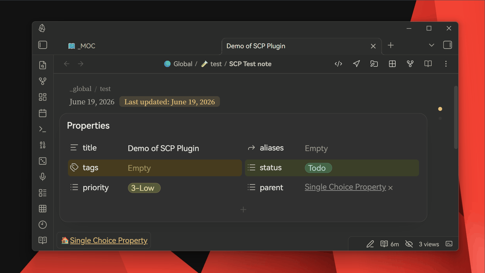
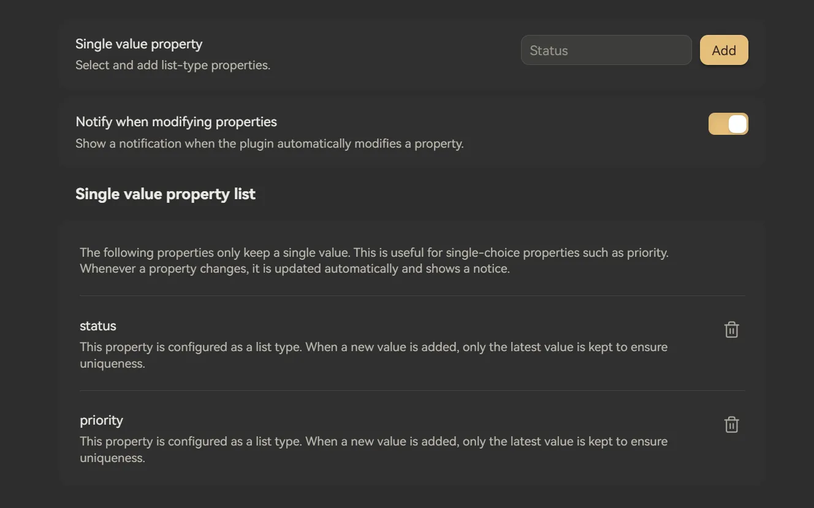

# Single Choice Property

English | [简体中文](https://github.com/moyf/single-choice-property#单选属性)

This is a simple single-feature plugin: Single Choice Property (SCP for short — yes, I'm on purpose.).



Its function is as shown in the image: it can **restrict a specific list property to a single value**. When added, it directly overwrites the original value without needing to manually delete the old one.

## WHY?
Although I think the functionality is self-explanatory... in simple terms, for properties like `status` or `priority`, they naturally don’t require "multiple values" (you can’t have a task that is both "in progress" and "cancelled," right?). But having to delete the old value and then add a new one each time is a bit tedious, so I wrote this plugin to automate it for me.

In a word, it's a *lazy person's plugin*—it doesn't add any new functionality, it just saves you one step :P

```
FROM:
Click, Ctrl+A, Backspace, Select New Value 

⬇️ TO:
Click, Select New Value
```
Saving 50% of the operations! 😎


> Once Obsidian supports "single-select" property, this plugin will no longer be necessary.


## The Capsule Style

The beautiful colorful capsule style is provided by [Typify](https://github.com/Leike-Dev/Obsidian-Typify) - this plugin is the source of inspiration for me to create SCP — it's simple, elegant, and I truly recommend it. ❤️

## How it works
By default, the plugin watches the `status` property.
You can add or remove watched property names in the plugin settings.



When a watched property becomes a list with more than one value, the plugin keeps only the last value and can show a Notice.

### Support

If you like Single Choice Property, consider [buying me a coffee on Ko-fi](https://ko-fi.com/moy) ☕

# 单选属性

[English](https://github.com/moyf/single-choice-property#single-choice-property) | 简体中文

这是个功能非常单纯的插件：单项——选择——属性（Single Choice Property，简称 SCP，没错，我故意的）


作用如图：可以把某个特定的列表属性限制为**只能留一个值**。添加新值时，直接覆盖原来的值，不需要你手动先删掉旧值。

虽然我觉得这个功能本身已经挺直观了……简单来说，像 `status`、`priority` 这类属性，本来就天然不需要“多个值”（你总不能让一个任务同时是“进行中”和“已取消”，对吧？）。但每次都要先删除旧值再添加新值还是有点麻烦，所以我写了这个插件帮自己自动处理。

一句话概括，这是一个 *懒人插件*：它不会带来什么全新能力，只是帮你少点一步 :P

```
原来的操作：
点击，全选，删除，选择新值

⬇️ 现在：
点击，选择新值
```

省了50%的操作噢！ 😎

> 等 Obsidian 官方支持“单选”属性之后，这个插件就没有存在的必要了。

---

顺带一提，属性漂亮的彩色胶囊样式来自 [Typify](https://github.com/Leike-Dev/Obsidian-Typify)——它也是我制作 SCP 的灵感来源：简洁、优雅，我超推荐！ ❤️

## 工作方式

默认情况下，插件会监听 `status` 属性。
你可以在插件设置中添加或移除需要监听的属性名。


当某个被监听的属性变成包含多个值的列表时，插件会只保留最后一个值，并且会（可选）弹出 Notice 提示。

### 支持作者

如果 Single Choice Property 对你有帮助，欢迎[请我喝杯咖啡（Ko-fi）](https://ko-fi.com/moy) ☕

